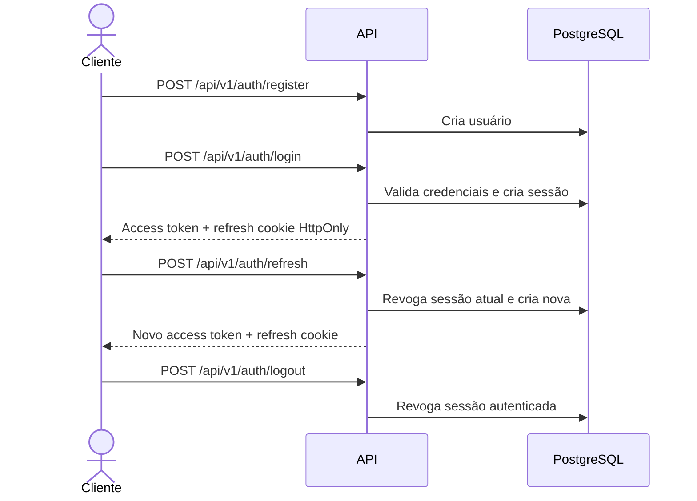
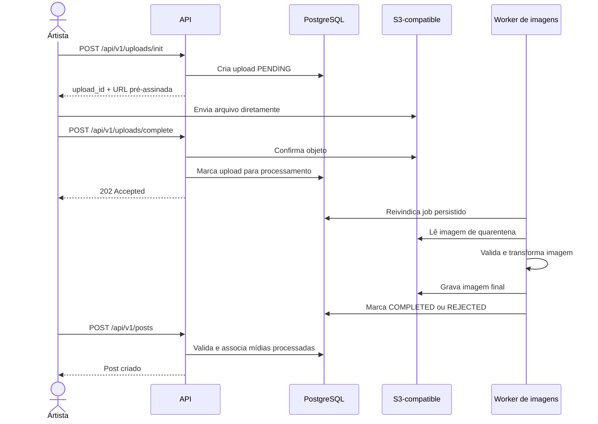
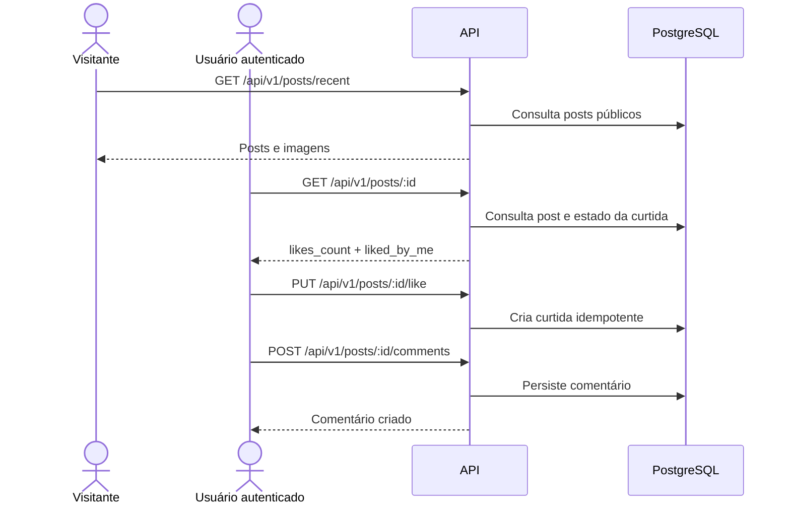
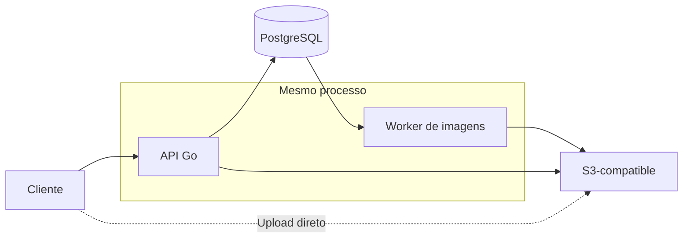
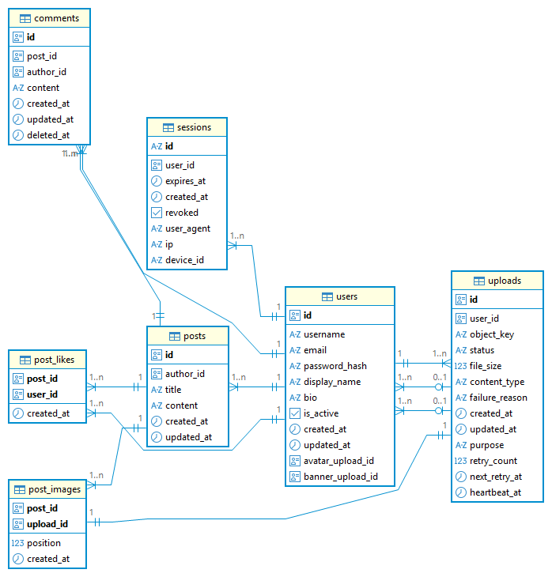

# Artblog API

API REST em Go para uma blog comunitário para artistas

## Funcionalidades

- Autenticação e gerenciamento de sessões;
- perfis públicos e gerenciamento do próprio perfil;
- criação e gerenciamento de posts;
- publicação de posts com imagens;
- listagem de posts recentes e por autor;
- curtidas em posts;
- comentários em posts;
- upload e processamento de imagens;
- uso de imagens em posts, avatares e banners.

## Principais fluxos

### Autenticação e renovação de sessão



### Publicação com imagens



### Consulta e interação social



## Diferenciais técnicos

### Arquitetura em camadas

O código preserva uma separação clara de responsabilidades:

```text
Handler -> Service -> Repository
```

- **Handlers:** HTTP, parsing, validação de entrada e respostas;
- **Services:** casos de uso, regras de negócio e autorização;
- **Repositories:** persistência e queries SQL;
- **Worker:** processamento assíncrono de imagens;
- **Adapters:** integração com PostgreSQL e storage S3-compatible.

As interfaces são definidas no lado consumidor e as transações são propagadas
por `context.Context`, evitando que um caso de uso transacional abra uma
transação independente.

### Upload direto e processamento assíncrono

Arquivos não precisam atravessar a API. O cliente recebe uma URL pré-assinada
e envia o conteúdo diretamente ao storage. Isso reduz a pressão sobre memória,
CPU e rede da API.

Depois da confirmação, o worker processa a imagem fora do ciclo da requisição.
O cliente consulta o status persistido até que o upload seja concluído ou
rejeitado.

### PostgreSQL como fila durável

O registro de upload também representa o job de processamento. O PostgreSQL é
a fonte de verdade da fila, com:

- `FOR UPDATE SKIP LOCKED` para concorrência segura;
- heartbeat para detectar jobs abandonados;
- retry com backoff;
- limite de tentativas;
- recuperação de jobs obsoletos;
- processamento idempotente;
- ticker periódico para encontrar jobs mesmo quando uma notificação em memória
  é perdida.

O worker roda no mesmo processo da API para simplificar a operação local, mas a
fila persistida permite extraí-lo para um serviço separado posteriormente.

### Segurança e autorização

- senhas protegidas com bcrypt;
- access tokens JWT com issuer e expiração;
- refresh tokens armazenados somente como hash SHA-256;
- cookies de refresh com `HttpOnly` e `SameSite`;
- rotação de refresh tokens e revogação da sessão anterior;
- autorização por ownership nos services;
- validação de propriedade, finalidade e estado dos uploads;
- queries parametrizadas e constraints do PostgreSQL;
- rate limiting global e reforçado nos endpoints de autenticação;
- validação de proxies confiáveis para evitar spoofing de IP.

### Qualidade e testabilidade

A cobertura de testes unitários contempla as principais camadas e componentes
da aplicação, incluindo HTTP, regras de negócio, persistência, middleware,
autenticação, processamento de imagens e worker. Testes de integração com
PostgreSQL via Testcontainers validam o comportamento junto ao banco e às
migrations. O pipeline também executa:

- verificação de formatação;
- `go vet`;
- Staticcheck;
- SQLC diff;
- testes com race detector;
- build da imagem Docker.

## Superfície HTTP

Todas as rotas da API usam o prefixo `/api/v1`. A especificação completa está
disponível no Swagger.

| Grupo | Exemplos | Acesso |
| --- | --- | --- |
| Autenticação | `register`, `login`, `refresh`, `logout` | público/protegido |
| Usuários | perfil público, perfil próprio, avatar e banner | misto |
| Posts | criar, consultar, listar, editar e remover | misto |
| Curtidas | `PUT` like e `DELETE` unlike | autenticado |
| Comentários | listar, criar, editar e remover | misto |
| Uploads | iniciar, concluir e consultar status | autenticado |

O Swagger é servido em `/swagger/index.html`, fora do prefixo da API.

## Arquitetura

O diagrama abaixo apresenta os principais componentes da aplicação e o fluxo
de comunicação entre o cliente, a API, o PostgreSQL, o storage de objetos e o
worker responsável pelo processamento assíncrono de imagens.



O worker executa no mesmo binário da API e usa o PostgreSQL como fila durável.
Ele pode ser extraído para um serviço separado no futuro.

Para o detalhamento de componentes, dados, runtime, segurança e decisões de
implementação, consulte [docs/architecture.md](docs/architecture.md).

## Modelagem dos dados
O diagrama entidade-relacionamento abaixo apresenta as relações
entre essas entidades



## Executar localmente

Requisitos: Docker, Docker Compose e Go 1.26+.

```bash
cp .env.example .env
make up
```

O comando sobe PostgreSQL e MinIO, cria o bucket, aplica as migrations,
constrói a imagem Docker e inicia a API.

| Comando | Ação |
| --- | --- |
| `make up` | Inicia o ambiente completo |
| `make migrate-up` | Aplica migrations pendentes |
| `make logs` | Exibe logs dos serviços |
| `make clean` | Remove containers e volumes locais |

Serviços locais:

- API: [http://localhost:8080](http://localhost:8080);
- Swagger: [http://localhost:8080/swagger/index.html](http://localhost:8080/swagger/index.html);
- MinIO API: [http://localhost:9000](http://localhost:9000);
- MinIO Console: [http://localhost:9001](http://localhost:9001).

## Roteiro de demonstração

Depois de executar `make up`, o fluxo abaixo apresenta as principais
funcionalidades:

1. abrir o Swagger;
2. registrar um usuário;
3. fazer login e copiar o access token retornado;
4. clicar em **Authorize** e informar `Bearer` seguido do token;
5. [iniciar o upload](#inicializar-o-upload) de uma imagem de post;
6. [enviar a imagem](#enviar-a-imagem) usando a URL pré-assinada;
7. concluir o upload '/complete';
8. consultar o status até o processamento terminar;
9. criar um post associando a imagem processada;
10. consultar o post pela listagem pública.

### Upload pelo terminal

O Swagger UI não encadeia automaticamente a inicialização do upload com o
envio do arquivo para o storage. Execute as duas etapas abaixo.

#### Inicializar o upload

No Swagger, execute `POST /api/v1/uploads/init` com o corpo:

```bash
IMAGE="./testdata/graziela-zahara-final.webp"
stat -c%s "$IMAGE"
```

```json
{
  "content_type": "image/webp",
  "file_size": 292582,
  "purpose": "POST_IMAGE"
}
```

O valor `292582` corresponde ao tamanho atual da imagem e deve ser exatamente
o tamanho do arquivo enviado, pois é usado para gerar a URL pré-assinada. Se a
imagem for substituída, atualize esse valor e o `Content-Type` conforme o novo
arquivo. Copie o `upload_url` e o `upload_id` retornados.

#### Enviar a imagem

```bash
IMAGE="./testdata/graziela-zahara-final.webp"
UPLOAD_URL="<upload_url retornado pela API>"

curl --request PUT "$UPLOAD_URL" \
  --resolve minio:9000:127.0.0.1 \
  --header "Content-Type: image/webp" \
  --data-binary "@$IMAGE"
```

```bash
UPLOAD_URL="http://minio:9000/artblog/quarantine/<id>?X-Amz-Algorithm=...&X-Amz-Signature=..."
```

Depois que o `PUT` terminar, execute no Swagger
`POST /api/v1/uploads/complete` usando o `upload_id`.

O botão **Authorize** mantém o token configurado para as demais requisições da
sessão do Swagger. Como o login atual retorna o JWT diretamente no corpo da
resposta, é necessário copiar o token e informá-lo manualmente no campo
`Bearer` seguido do token.

## Validação

```bash
gofmt -w .
go mod tidy
go vet ./...
go tool staticcheck -checks=all,-ST1000,-U1000 ./...
go test -race -count=1 ./...
docker build -t artblogapi:local .
```

Os testes de integração usam PostgreSQL via Testcontainers. O workflow de CI
executa as verificações de formatação, dependências, SQLC, vet, Staticcheck,
testes com race detector e build da imagem Docker.

## Documentação

- [Arquitetura e fluxo de processamento](docs/architecture.md)
- [Modelo entidade-relacionamento](docs/erd.png)
- [Especificação Swagger](docs/swagger/swagger.yaml)

## Próximos passos

- **Autorização administrativa:** adicionar RBAC, criação segura do primeiro
  administrador e proteção de operações administrativas.

- **Verificação de e-mail:** confirmar a posse do endereço antes de liberar
  completamente a conta e permitir a atualização segura do e-mail.

- **Recuperação de senha:** implementar tokens temporários, expiração, uso
  único e fluxo de redefinição por e-mail.

- **Limpeza de uploads:** definir retenção e coleta de uploads abandonados,
  rejeitados e substituídos no banco e no storage.
