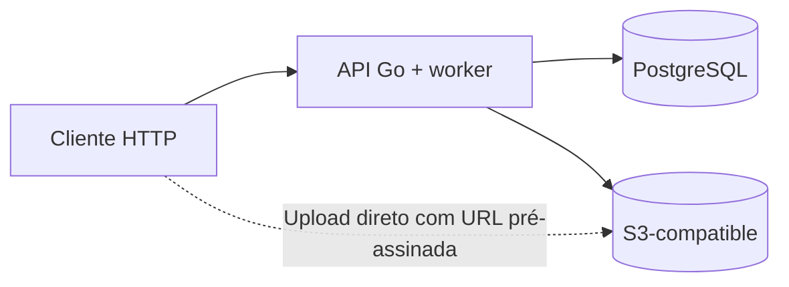
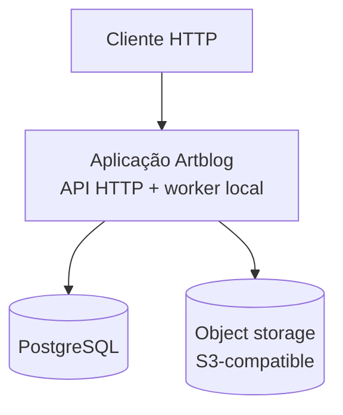
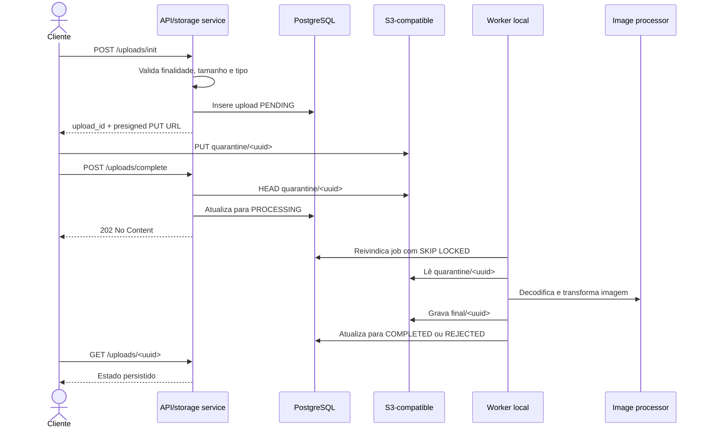

## 1. Escopo

O sistema atual cobre autenticação, usuários, perfis, posts e upload com
processamento assíncrono de imagens.

## 2. Contexto e ambiente

O cliente chama a API HTTP. Para arquivos, a API cria uma autorização
temporária e o cliente envia o conteúdo diretamente ao storage compatível com
S3.



## 3. Inicialização, configuração e encerramento

`cmd/main.go` executa o bootstrap nesta ordem:

1. carrega as variáveis de ambiente;
2. configura o logger;
3. cria e testa o pool PostgreSQL;
4. inicializa o cliente S3;
5. compõe repositories, services, handlers e rotas;
6. inicia o worker de imagens;
7. inicia o servidor HTTP.

A aplicação carrega configurações de banco, JWT, porta, logging, storage,
cookies e worker por variáveis de ambiente. `DATABASE_URL` e `JWT_SECRET` são
obrigatórios; os demais valores possuem defaults quando aplicável.

Ao receber `SIGINT` ou `SIGTERM`, o processo encerra o servidor HTTP, cancela o
worker, aguarda suas goroutines e fecha o pool PostgreSQL.

## 4. Visão de componentes em runtime

Os componentes abaixo representam responsabilidades em runtime. A API e o
worker de imagens executam no mesmo processo.



### Aplicação

A API HTTP e o worker de imagens executam no mesmo binário. Não existe um
serviço de worker separado.

### PostgreSQL

Armazena identidades, sessões, uploads, posts, relações de imagens e o estado
durável dos trabalhos de processamento.

### Object storage

O código usa AWS SDK for Go v2 contra um provedor S3-compatible. MinIO é usado
somente no desenvolvimento local. Endpoint, bucket, região, credenciais, TTL
de presign e path style são configuráveis.

## 5. Organização do código

As features principais ficam em `internal/auth`, `internal/user`,
`internal/post` e `internal/storage`.

```text
Handler -> Service -> Repository
```

- handlers cuidam de HTTP;
- services implementam casos de uso;
- repositories cuidam de persistência;
- interfaces são definidas por quem as consome;
- limites e regras de negócio pertencem ao domínio;
- transações compartilhadas são propagadas pelo contexto usando `db/tx.go`.

### Auth

`internal/auth` implementa registro, login, refresh e logout, além da criação
e validação dos componentes de sessão.

### Users

`internal/user` gerencia perfis, busca em lote e vínculos de avatar e banner.

### Posts

`internal/post` gerencia criação, consulta, listagem, atualização e exclusão
de posts. O modelo atual suporta título, conteúdo textual e até dez imagens
ordenadas.

### Storage

`internal/storage` coordena inicialização, conclusão, status, vínculo e
substituição de uploads. `internal/storage/image` processa imagens e o worker
local coordena o processamento assíncrono.

## 6. Dados, migrations e código gerado

As migrations em `db/migrations/` definem:

- `users`: identidade, credenciais, perfil e referências de avatar/banner;
- `sessions`: hash, expiração, revogação e metadados de refresh;
- `uploads`: estado, finalidade, chave, tamanho, tipo, retry e agendamento;
- `posts`: autor, título, conteúdo e timestamps;
- `post_images`: relação ordenada entre posts e uploads.

`db/queries/` contém as consultas SQL usadas como entrada pelo SQLC, que gera os
arquivos em `db/dbgen/`; esses arquivos não devem ser editados manualmente.
As migrações são aplicadas pelo Goose.

Os testes de integração sobem PostgreSQL com testcontainers e aplicam as
migrations automaticamente. A execução normal da API não aplica migrations;
o banco deve estar preparado antes do início do processo.

## 7. Runtime

### Upload e processamento de imagens



O fluxo implementado é:

1. a API valida finalidade, tamanho e tipo;
2. cria um upload `PENDING` e devolve uma URL pré-assinada;
3. o cliente envia o arquivo diretamente ao storage;
4. a API confirma o objeto e marca o trabalho para processamento;
5. o worker reivindica o trabalho no PostgreSQL, processa a imagem e grava o
   objeto final;
6. o cliente consulta o estado persistido.

O PostgreSQL é a fila durável. A notificação em memória é somente um sinal para
acelerar o worker. Heartbeat, retry, backoff, recuperação de jobs órfãos e
`FOR UPDATE SKIP LOCKED` evitam depender de uma requisição ativa.

O worker verifica o objeto final para manter idempotência, cancela o contexto
no shutdown e aguarda suas goroutines.

### Vínculos de mídia

Perfis e posts só vinculam uploads que atendem às validações de propriedade,
finalidade e estado. A entidade consumidora faz a alteração dentro da própria
transação. Um upload processado só pode ser vinculado uma vez. Substituições
podem marcar a mídia anterior como `SUPERSEDED`; a coleta física ainda não está
implementada.

## 8. Operação e interfaces

### Superfície HTTP

As rotas da aplicação usam o prefixo `/api/v1`. As rotas públicas incluem
registro, login, refresh, consulta de perfis públicos e consulta de posts.
Logout, gerenciamento do próprio perfil, uploads e operações de criação,
alteração e remoção de posts exigem autenticação.

O Swagger é servido em `/swagger/*any`, fora do prefixo `/api/v1`.

### Swagger

A especificação Swagger é gerada a partir das anotações da API e os arquivos
gerados ficam em `docs/swagger/`. Alterações nessas anotações exigem
regeneração.

### Logging e erros

`config/logger/` configura `slog`, com texto fora de produção e JSON quando
`APP_ENV=production`. Validações de entrada e erros HTTP são padronizados nos
componentes de configuração e resposta.

### Autenticação e sessões

- senhas usam bcrypt;
- access tokens são JWT HS256 com issuer e expiração configuráveis;
- refresh tokens são opacos, armazenados apenas como hash SHA-256 e enviados em
  cookie `HttpOnly`;
- refresh revoga a sessão usada e cria outra em transação;
- endpoints protegidos exigem access JWT;
- operações de usuário, upload e post autorizam o usuário no service;
- logout só revoga sessão pertencente ao usuário atual;
- access token não é consultado no banco.

### Conteúdo

O conteúdo textual dos posts é texto simples. O servidor não renderiza HTML a
partir desse conteúdo.

## 9. Segurança e limites

- senhas são armazenadas com bcrypt;
- access tokens usam JWT com issuer e expiração;
- refresh tokens são armazenados somente como hash, rotacionados a cada
  renovação e revogados em caso de reuse;
- refresh cookies usam `HttpOnly` e `SameSite`; `Secure` é configurável e deve
  ser habilitado no ambiente HTTPS;
- endpoints protegidos validam o usuário autenticado;
- uploads validam finalidade, tipo declarado e tamanho máximo por finalidade;
- URLs pré-assinadas incluem tipo e tamanho esperados;
- o worker decodifica a imagem e limita as dimensões da imagem processada na
  saída, usa retry,
  heartbeat, recuperação de jobs obsoletos e processamento idempotente;
- vínculos de mídia verificam propriedade, finalidade, estado e uso único;
- posts limitam título, quantidade de imagens e paginação;
- migrations e queries usam SQLC, queries parametrizadas e constraints do
  PostgreSQL.
- O sistema usa autorização por propriedade 'ownership';

## 10. Testes

Os comandos principais de validação estão definidos no `Makefile`. 
