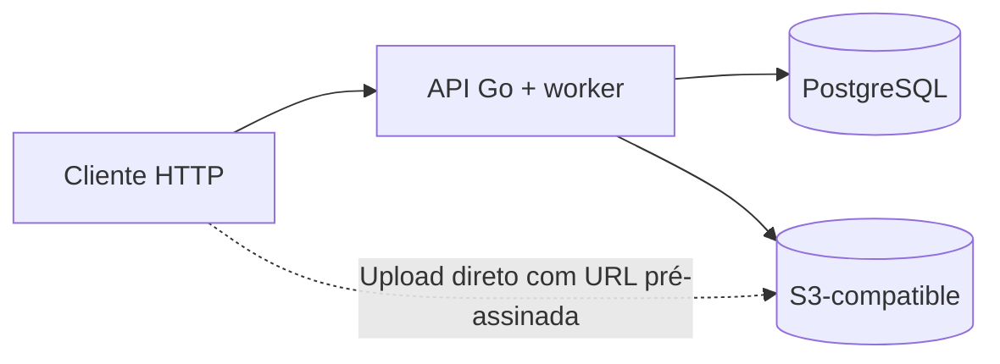
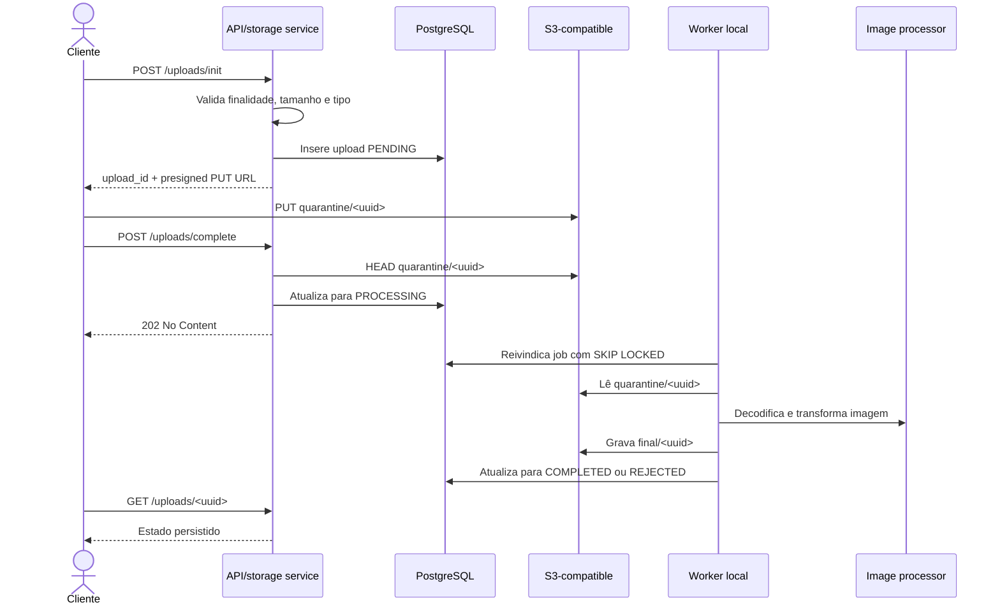
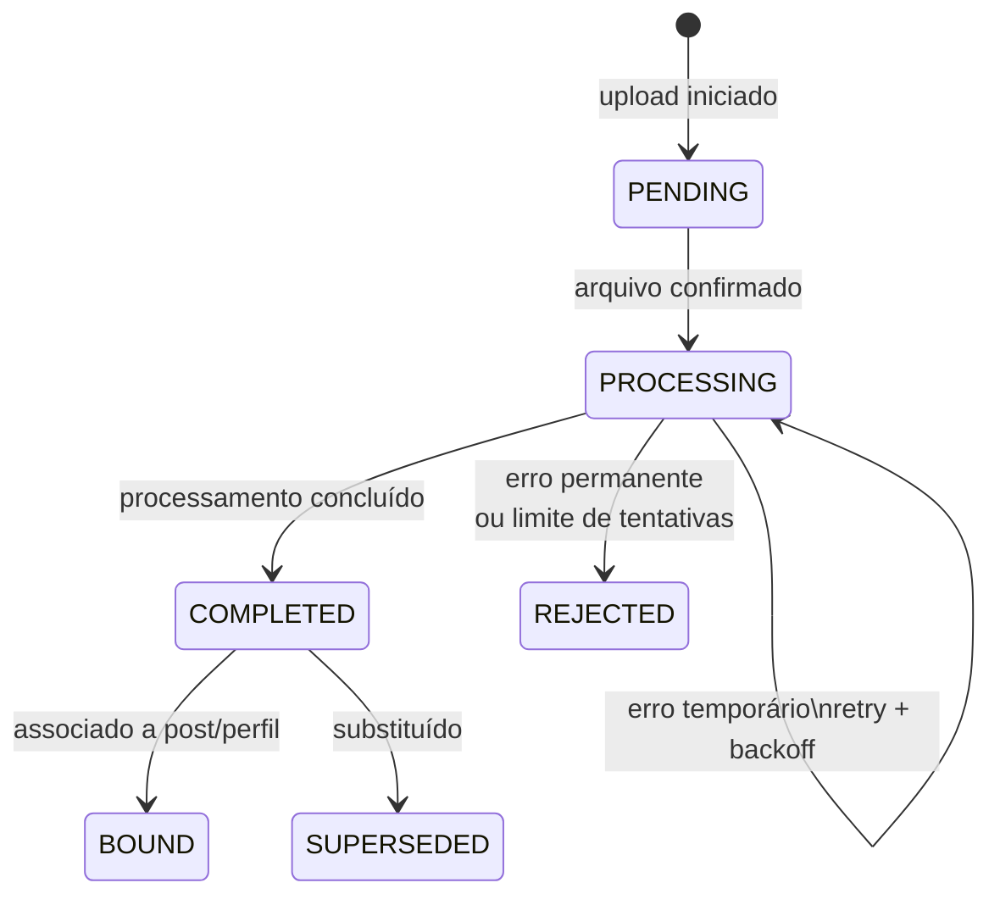
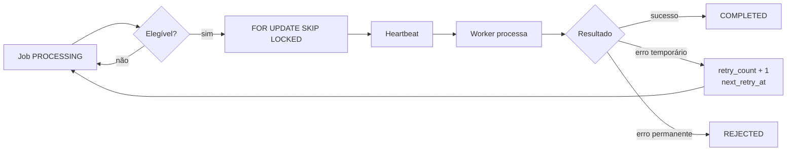

## 1. Escopo

O sistema atual cobre autenticação, usuários, perfis, posts e upload com
processamento assíncrono de imagens.

## 2. Contexto e ambiente

O cliente chama a API HTTP. Para arquivos, a API cria uma autorização
temporária e o cliente envia o conteúdo diretamente ao storage compatível com
S3. A API HTTP e o worker de imagens executam no mesmo processo. O PostgreSQL
armazena identidades, sessões, posts, uploads e o estado durável dos trabalhos;
o storage usa AWS SDK for Go v2 contra um provedor S3-compatible. MinIO é usado
no desenvolvimento local.


```mermaid
flowchart LR
    Client[Cliente HTTP] --> App[API Go + worker]
    App --> DB[(PostgreSQL)]
    App --> Storage[(S3-compatible)]
    Client -. Upload direto com URL pré-assinada .-> Storage
```

## 3. Inicialização, configuração e encerramento

`cmd/main.go` executa o bootstrap nesta ordem:

1. carrega as variáveis de ambiente;
2. configura o logger;
3. cria e testa o pool PostgreSQL;
4. inicializa o cliente S3;
5. compõe repositories, services, handlers e rotas;
6. inicia o worker de imagens;
7. inicia o servidor HTTP.

A aplicação carrega configurações de banco, JWT, porta, logging, storage,
cookies, rate limiting e worker por variáveis de ambiente. `DATABASE_URL` e `JWT_SECRET` são
obrigatórios; os demais valores possuem defaults quando aplicável.

Ao receber `SIGINT` ou `SIGTERM`, o processo encerra o servidor HTTP, cancela o
worker, aguarda suas goroutines e fecha o pool PostgreSQL.

## 4. Organização do código

As features principais ficam em `internal/auth`, `internal/user`,
`internal/post`, `internal/comment` e `internal/storage`.

```text
Handler -> Service -> Repository
```

- handlers cuidam de HTTP;
- services implementam casos de uso;
- repositories cuidam de persistência;
- interfaces são definidas por quem as consome;
- limites e regras de negócio pertencem ao domínio;
- transações compartilhadas são propagadas pelo contexto usando `db/tx.go`.

### Auth

`internal/auth` implementa registro, login, refresh e logout, além da criação
e validação dos componentes de sessão.

### Users

`internal/user` gerencia perfis, busca em lote e vínculos de avatar e banner.

### Posts

`internal/post` gerencia criação, consulta, listagem, atualização e exclusão
de posts. O modelo atual suporta título, conteúdo textual e até dez imagens
ordenadas.

### Comments

`internal/comment` gerencia comentários de nível único em posts. A listagem é
pública e paginada; criação, edição e exclusão lógica exigem autenticação, e o
service garante que somente o autor altere seu comentário. O conteúdo é
normalizado e limitado a 500 caracteres. Respostas aninhadas não fazem parte
do modelo atual.

### Storage

`internal/storage` coordena inicialização, conclusão, status, vínculo e
substituição de uploads. `internal/storage/image` processa imagens e o worker
de imagens coordena o processamento assíncrono.

### Decisões arquiteturais

- PostgreSQL também funciona como fila durável, evitando uma dependência
  adicional para os jobs de imagem.
- O worker de imagens permanece no mesmo processo para simplificar a operação
  local; a fila persistida mantém a possibilidade de extraí-lo futuramente
  para um serviço separado.
- Uploads são enviados diretamente ao storage compatível com S3 por URL
  pré-assinada, reduzindo o tráfego de arquivos pela API.
- SQLC mantém as queries explícitas e gera código tipado a partir do SQL.

## 5. Dados, migrações e código gerado

As migrações em `db/migrations/` definem:

- `users`: identidade, credenciais, perfil e referências de avatar/banner;
- `sessions`: hash, expiração, revogação e metadados de refresh;
- `uploads`: estado, finalidade, chave, tamanho, tipo, retry e agendamento;
- `posts`: autor, título, conteúdo e timestamps;
- `comments`: post, autor, conteúdo, timestamps e `deleted_at` para exclusão
  lógica;
- `post_likes`: relação única entre usuário e post, com chave composta,
  timestamp e exclusão em cascata;
- `post_images`: relação ordenada entre posts e uploads.

`db/queries/` contém as consultas SQL usadas como entrada pelo SQLC, que gera os
arquivos em `db/dbgen/`; esses arquivos não devem ser editados manualmente.
As migrações são aplicadas pelo Goose.

Os testes de integração sobem PostgreSQL com Testcontainers e aplicam as
migrações automaticamente. A execução normal da API não aplica migrações;
o banco deve estar preparado antes do início do processo. No desenvolvimento
local, `make up` sobe as dependências, aplica as migrações pendentes e inicia
a API em um container; `make migrate-up` pode ser usado para aplicar somente
as migrações.

## 6. Runtime

### Upload e processamento de imagens


```mermaid
sequenceDiagram
    actor Client as Cliente
    participant API as API/storage service
    participant DB as PostgreSQL
    participant S3 as S3-compatible
    participant W as Worker local
    participant IMG as Image processor

    Client->>API: POST /uploads/init
    API->>API: Valida finalidade, tamanho e tipo
    API->>DB: Insere upload PENDING
    API-->>Client: upload_id + presigned PUT URL
    Client->>S3: PUT quarantine/<uuid>
    Client->>API: POST /uploads/complete
    API->>S3: HEAD quarantine/<uuid>
    API->>DB: Atualiza para PROCESSING
    API-->>Client: 202 No Content
    W->>DB: Reivindica job com SKIP LOCKED
    W->>S3: Lê quarantine/<uuid>
    W->>IMG: Decodifica e transforma imagem
    W->>S3: Grava final/<uuid>
    W->>DB: Atualiza para COMPLETED ou REJECTED
    Client->>API: GET /uploads/<uuid>
    API-->>Client: Estado persistido
```

O fluxo implementado é:

1. a API valida finalidade, tamanho e tipo;
2. cria um upload `PENDING` e devolve uma URL pré-assinada;
3. o cliente envia o arquivo diretamente ao storage;
4. a API confirma o objeto e marca o trabalho para processamento;
5. o worker reivindica o trabalho no PostgreSQL, processa a imagem e grava o
   objeto final;
6. o cliente consulta o estado persistido.

O PostgreSQL é a fila durável.

### PostgreSQL como fila de trabalhos

O PostgreSQL funciona como uma fila baseada em estado. O job é o próprio
registro em `uploads`, e seu ciclo é representado pelo status:


```mermaid
stateDiagram-v2
    [*] --> PENDING: upload iniciado
    PENDING --> PROCESSING: arquivo confirmado
    PROCESSING --> COMPLETED: processamento concluído
    PROCESSING --> PROCESSING: erro temporário\nretry + backoff
    PROCESSING --> REJECTED: erro permanente<br/>ou limite de tentativas
    COMPLETED --> BOUND: associado a post/perfil
    COMPLETED --> SUPERSEDED: substituído
```

Além do fluxo principal de processamento, `EXPIRED` representa uploads que
perderam a validade antes da conclusão; `BOUND` indica mídia já associada a uma
entidade; `SUPERSEDED` indica mídia substituída; e `DELETED` representa mídia
removida do ciclo ativo. Esses estados complementam o processamento e não são
novas etapas do worker.

O worker busca o próximo job elegível, bloqueia somente a linha selecionada
com `SKIP LOCKED` e registra o heartbeat:


```mermaid
flowchart LR
    A[Job PROCESSING] --> B{Elegível?}
    B -- não --> A
    B -- sim --> C[FOR UPDATE SKIP LOCKED]
    C --> D[Heartbeat]
    D --> E[Worker processa]
    E --> F{Resultado}
    F -- sucesso --> G[COMPLETED]
    F -- erro temporário --> H[retry_count + 1<br/>next_retry_at]
    H --> A
    F -- erro permanente --> I[REJECTED]
```

| Recurso | Papel |
| --- | --- |
| PostgreSQL | Fila durável e fonte de verdade |
| `SKIP LOCKED` | Concorrência segura entre workers |
| `heartbeat_at` | Recuperação de jobs órfãos |
| `retry_count` | Limite de tentativas |
| `next_retry_at` | Backoff entre tentativas |
| Status | Ciclo de vida persistido |

O canal em memória `triggerChan` não contém o job e não é requisito de
correção. Ele é apenas uma notificação não bloqueante para reduzir a latência
entre a confirmação do upload e a busca do worker. Um ticker periódico garante
que jobs persistidos também sejam encontrados quando a notificação for perdida.

### Vínculos de mídia

Perfis e posts só vinculam uploads que atendem às validações de propriedade,
finalidade e estado. A entidade consumidora faz a alteração dentro da própria
transação. Um upload processado só pode ser vinculado uma vez. Substituições
podem marcar a mídia anterior como `SUPERSEDED`; a coleta física ainda não está
implementada.

### Invariantes do domínio

- posts podem ter no máximo dez imagens;
- comentários possuem limite de 500 caracteres e só podem ser alterados pelo
  próprio autor;
- somente uploads processados, pertencentes ao usuário e com finalidade
  compatível podem ser associados;
- um upload processado só pode ser vinculado uma vez;
- cada usuário pode ter no máximo uma curtida por post.

## 7. Operação e interfaces

### Superfície HTTP

As rotas da aplicação usam o prefixo `/api/v1`. As rotas públicas incluem
registro, login, refresh, consulta de perfis públicos e consulta de posts.
As respostas de posts incluem `likes_count` e `liked_by_me`; o segundo campo é
`false` para visitantes não autenticados. Curtir e descurtir posts exige
autenticação e usa `PUT /posts/:id/like` e `DELETE /posts/:id/like`,
respectivamente. Ambas as operações são idempotentes.
Logout, gerenciamento do próprio perfil, uploads e operações de criação,
alteração e remoção de posts exigem autenticação. Comentários podem ser
listados publicamente em `/posts/:id/comments`; criar, alterar e excluir
comentários exige autenticação e autorização do autor.

O Swagger é servido em `/swagger/*any`, fora do prefixo `/api/v1`.

### Swagger

A especificação Swagger é gerada a partir das anotações da API e os arquivos
gerados ficam em `docs/swagger/`. Alterações nessas anotações exigem
regeneração.

### Rate limiting

A API implementa rate limiting in-memory baseado no algoritmo token bucket
(`golang.org/x/time/rate`). O controle opera em dois níveis quando habilitado:

- **Global**: aplicado a todo o grupo `/api/v1` (default: 100 requisições/minuto);
- **Autenticação**: aplicado a `/auth/register`, `/auth/login` e `/auth/refresh`
  (default: 10 requisições/minuto) para proteção contra brute force.

Quando o limite é excedido, a resposta retorna status HTTP `429 Too Many Requests`,
código de erro `RATE_LIMITED` no padrão da API e o cabeçalho `Retry-After` com o
tempo de espera estimado em segundos.

A identificação do IP do cliente valida proxies reversos contra uma lista de CIDRs
configurados (`RATE_LIMIT_TRUSTED_PROXIES`), ignorando cabeçalhos de encaminhamento
vindos de fontes não confiáveis. O IP é resolvido uma única vez pelo middleware
global de captura de IP e propagado pelo `context.Context` da requisição; o rate
limiter e os handlers de autenticação consultam esse valor compartilhado, sem
interpretar `RemoteAddr` ou headers de proxy individualmente.

### Logging e erros

`config/logger/` configura `slog`, com texto fora de produção e JSON quando
`APP_ENV=production`. Validações de entrada e erros HTTP são padronizados nos
componentes de configuração e resposta.

### Autenticação e sessões

- senhas usam bcrypt;
- access tokens são JWT HS256 com issuer e expiração configuráveis;
- refresh tokens são opacos, armazenados apenas como hash SHA-256 e enviados em
  cookie `HttpOnly`;
- refresh revoga a sessão usada e cria outra em transação;
- endpoints protegidos exigem access JWT;
- operações de usuário, upload e post autorizam o usuário no service;
- logout só revoga sessão pertencente ao usuário atual;
- access token não é consultado no banco.

### Conteúdo

O conteúdo textual dos posts é texto simples. O servidor não renderiza HTML a
partir desse conteúdo.

## 8. Segurança e limites

- O fluxo de autenticação, a rotação de sessões e os cookies de refresh estão
  descritos na seção [Autenticação e sessões](#autenticação-e-sessões).
- uploads validam finalidade, tipo declarado e tamanho máximo por finalidade;
- URLs pré-assinadas incluem tipo e tamanho esperados;
- endpoints protegidos validam o usuário autenticado;
- o worker valida dimensões e pixels da imagem de entrada de acordo com a
  finalidade antes da decodificação completa, limita as dimensões da imagem
  processada na saída e usa retry,
  heartbeat, recuperação de jobs obsoletos e processamento idempotente;
- vínculos de mídia verificam propriedade, finalidade, estado e uso único;
- posts limitam título, quantidade de imagens e paginação;
- migrações e queries usam SQLC, queries parametrizadas e constraints do
  PostgreSQL.
- O sistema usa autorização por propriedade 'ownership';
- rate limiting em memória usando token bucket protege a API `/api/v1` e
  aplica restrição reforçada contra força bruta nos endpoints de autenticação
  (`/register`, `/login`, `/refresh`);
- a resolução de IP do cliente valida proxies reversos com CIDRs configurados
  (`RATE_LIMIT_TRUSTED_PROXIES`), ignorando headers de encaminhamento de
  origens não confiáveis para prevenir spoofing de IP;

## 9. Testes

Os testes unitários são organizados por camada e cobrem handlers, services,
repositories, middleware, autenticação, processamento de imagens e worker. Os
testes de integração usam PostgreSQL via Testcontainers e aplicam as migrações
automaticamente. Os comandos principais de validação estão definidos no
`Makefile`.
